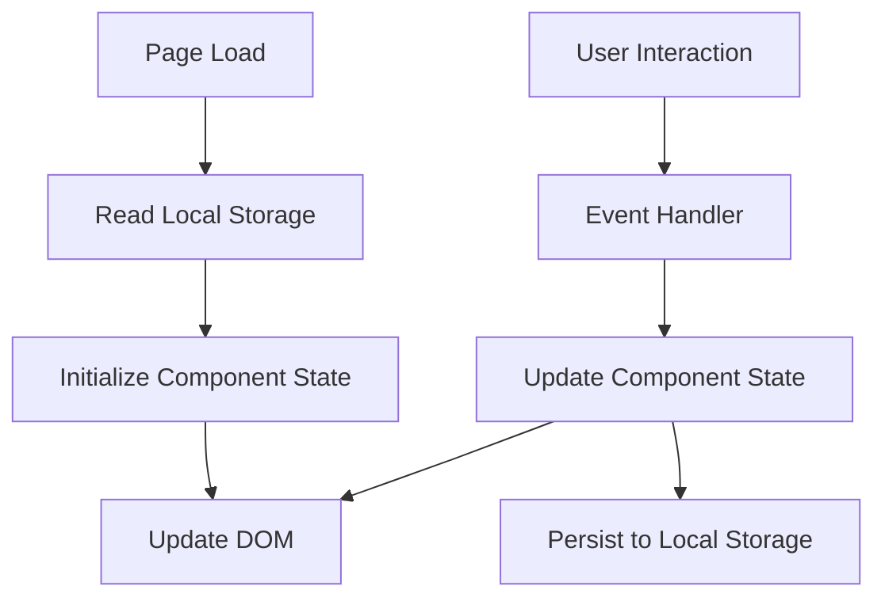

# Design Document: Productivity Dashboard

## Overview

The Productivity Dashboard is a single-page web application built entirely with vanilla HTML, CSS, and JavaScript. It provides four main components: a time-aware greeting display, a 25-minute focus timer, a task management system, and quick links to favorite websites. All user data is persisted client-side using the browser's Local Storage API.

The application follows a component-based architecture where each feature (greeting, timer, tasks, links) is implemented as a self-contained module with its own state management and DOM manipulation logic. The design emphasizes simplicity, performance, and maintainability without relying on any external frameworks or libraries.

### Key Design Principles

1. **Vanilla Implementation**: Pure JavaScript, HTML, and CSS with no dependencies
2. **Component Isolation**: Each feature operates independently with clear boundaries
3. **Client-Side Persistence**: All data stored in Local Storage with graceful degradation
4. **Immediate Feedback**: UI updates within 100ms of user actions
5. **Progressive Enhancement**: Core functionality works even if Local Storage fails

## Architecture

### High-Level Structure

```
productivity-dashboard/
├── index.html          # Main HTML structure
├── css/
│   └── styles.css      # All application styles
└── js/
    └── app.js          # All application logic
```

### Component Architecture

The application is organized into four primary components, each implemented as a JavaScript module pattern:

1. **GreetingDisplay**: Manages time, date, and contextual greeting
2. **FocusTimer**: Handles 25-minute countdown timer with controls
3. **TaskManager**: Manages task CRUD operations and persistence
4. **QuickLinksManager**: Manages link CRUD operations and persistence

Each component follows this pattern:
- Encapsulated state (private variables)
- Public initialization method
- DOM element references
- Event handlers
- Render methods
- Local Storage integration

### Data Flow



## Components and Interfaces

### 1. GreetingDisplay Component

**Responsibility**: Display current time, date, and time-based greeting

**State**:
- `currentTime`: Date object updated every second
- `greetingInterval`: setInterval reference for cleanup

**Public Interface**:
```javascript
GreetingDisplay.init(containerElement)
GreetingDisplay.destroy() // Cleanup intervals
```

**DOM Structure**:
```html
<div class="greeting-container">
  <div class="greeting-message">Good morning</div>
  <div class="current-time">10:30 AM</div>
  <div class="current-date">Monday, January 15, 2024</div>
</div>
```

**Key Methods**:
- `getGreeting(hour)`: Returns appropriate greeting based on hour (5-11: morning, 12-16: afternoon, 17-20: evening, 21-4: night)
- `formatTime(date)`: Returns 12-hour format with AM/PM
- `formatDate(date)`: Returns readable date format
- `updateDisplay()`: Updates all display elements
- `startClock()`: Begins 1-second interval updates

### 2. FocusTimer Component

**Responsibility**: 25-minute countdown timer with start/stop/reset controls

**State**:
- `totalSeconds`: Total seconds (initialized to 1500 for 25 minutes)
- `remainingSeconds`: Current countdown value
- `timerInterval`: setInterval reference
- `isRunning`: Boolean timer state

**Public Interface**:
```javascript
FocusTimer.init(containerElement)
FocusTimer.start()
FocusTimer.stop()
FocusTimer.reset()
FocusTimer.destroy() // Cleanup intervals
```

**DOM Structure**:
```html
<div class="timer-container">
  <div class="timer-display">25:00</div>
  <div class="timer-controls">
    <button class="btn-start">Start</button>
    <button class="btn-stop">Stop</button>
    <button class="btn-reset">Reset</button>
  </div>
  <div class="timer-status"></div>
</div>
```

**Key Methods**:
- `formatTime(seconds)`: Converts seconds to MM:SS format
- `tick()`: Decrements remainingSeconds and updates display
- `handleComplete()`: Triggered when timer reaches zero
- `updateDisplay()`: Renders current time and button states
- `updateButtonStates()`: Enables/disables buttons based on timer state

### 3. TaskManager Component

**Responsibility**: CRUD operations for tasks with Local Storage persistence

**State**:
- `tasks`: Array of task objects
- `nextId`: Counter for generating unique task IDs

**Task Object Structure**:
```javascript
{
  id: number,
  text: string,
  completed: boolean,
  createdAt: timestamp
}
```

**Public Interface**:
```javascript
TaskManager.init(containerElement)
TaskManager.addTask(text)
TaskManager.editTask(id, newText)
TaskManager.toggleTask(id)
TaskManager.deleteTask(id)
TaskManager.getTasks()
```

**DOM Structure**:
```html
<div class="task-container">
  <div class="task-input-section">
    <input type="text" class="task-input" placeholder="Add a new task...">
    <button class="btn-add-task">Add</button>
  </div>
  <ul class="task-list">
    <li class="task-item" data-id="1">
      <input type="checkbox" class="task-checkbox">
      <span class="task-text">Task description</span>
      <button class="btn-edit-task">Edit</button>
      <button class="btn-delete-task">Delete</button>
    </li>
  </ul>
</div>
```

**Key Methods**:
- `loadFromStorage()`: Retrieves tasks from Local Storage
- `saveToStorage()`: Persists tasks array to Local Storage
- `renderTasks()`: Rebuilds task list DOM
- `createTaskElement(task)`: Generates DOM for single task
- `handleAdd()`: Creates new task from input
- `handleEdit(id)`: Enables inline editing for task
- `handleToggle(id)`: Flips completion status
- `handleDelete(id)`: Removes task from array and storage

**Local Storage Key**: `productivity-dashboard-tasks`

### 4. QuickLinksManager Component

**Responsibility**: CRUD operations for quick links with Local Storage persistence

**State**:
- `links`: Array of link objects
- `nextId`: Counter for generating unique link IDs

**Link Object Structure**:
```javascript
{
  id: number,
  name: string,
  url: string,
  createdAt: timestamp
}
```

**Public Interface**:
```javascript
QuickLinksManager.init(containerElement)
QuickLinksManager.addLink(name, url)
QuickLinksManager.deleteLink(id)
QuickLinksManager.getLinks()
```

**DOM Structure**:
```html
<div class="links-container">
  <div class="link-input-section">
    <input type="text" class="link-name-input" placeholder="Link name">
    <input type="url" class="link-url-input" placeholder="https://example.com">
    <button class="btn-add-link">Add Link</button>
  </div>
  <div class="links-grid">
    <div class="link-item" data-id="1">
      <a href="https://example.com" target="_blank" rel="noopener noreferrer">
        <span class="link-name">Example</span>
      </a>
      <button class="btn-delete-link">×</button>
    </div>
  </div>
</div>
```

**Key Methods**:
- `loadFromStorage()`: Retrieves links from Local Storage
- `saveToStorage()`: Persists links array to Local Storage
- `renderLinks()`: Rebuilds links grid DOM
- `createLinkElement(link)`: Generates DOM for single link
- `handleAdd()`: Creates new link from inputs
- `handleDelete(id)`: Removes link from array and storage
- `validateUrl(url)`: Ensures URL is properly formatted

**Local Storage Key**: `productivity-dashboard-links`

### 5. Application Controller

**Responsibility**: Initialize all components and handle global error states

**Public Interface**:
```javascript
App.init()
App.handleStorageError(componentName)
```

**Key Methods**:
- `checkLocalStorageAvailable()`: Tests Local Storage accessibility
- `initializeComponents()`: Calls init on all components
- `setupErrorHandling()`: Configures global error handlers
- `showStorageError(message)`: Displays user-friendly error message

## Data Models

### Local Storage Schema

**Tasks Storage**:
```javascript
// Key: "productivity-dashboard-tasks"
// Value: JSON string
[
  {
    "id": 1,
    "text": "Complete project documentation",
    "completed": false,
    "createdAt": 1705334400000
  },
  {
    "id": 2,
    "text": "Review pull requests",
    "completed": true,
    "createdAt": 1705334460000
  }
]
```

**Links Storage**:
```javascript
// Key: "productivity-dashboard-links"
// Value: JSON string
[
  {
    "id": 1,
    "name": "GitHub",
    "url": "https://github.com",
    "createdAt": 1705334400000
  },
  {
    "id": 2,
    "name": "Documentation",
    "url": "https://developer.mozilla.org",
    "createdAt": 1705334460000
  }
]
```

### Data Validation Rules

**Task Validation**:
- `text`: Non-empty string, trimmed, max 500 characters
- `completed`: Boolean value
- `id`: Positive integer, unique within tasks array

**Link Validation**:
- `name`: Non-empty string, trimmed, max 100 characters
- `url`: Valid URL format (http:// or https://), max 2000 characters
- `id`: Positive integer, unique within links array

### Storage Error Handling

When Local Storage is unavailable or quota exceeded:
1. Component catches storage exception
2. Component calls `App.handleStorageError(componentName)`
3. Error message displayed to user: "Unable to save {component} data. Your changes will be lost when you close this page."
4. Component continues to function with in-memory state only
5. No further storage attempts made until page reload


## Correctness Properties

*A property is a characteristic or behavior that should hold true across all valid executions of a system-essentially, a formal statement about what the system should do. Properties serve as the bridge between human-readable specifications and machine-verifiable correctness guarantees.*

### Property Reflection

After analyzing all acceptance criteria, I identified the following redundancies:
- Properties 3.3 and 3.4 (task list growth and persistence) can be combined - if we verify persistence works, the list growth is implicit
- Properties 3.4, 4.4, 5.3, 5.6, 6.1 all test persistence round-trips for tasks - these can be consolidated into comprehensive persistence properties
- Properties 7.3 and 7.4 (link collection growth and persistence) have the same redundancy as tasks
- Properties 7.4, 7.7, 8.1 all test persistence round-trips for links - these can be consolidated
- Greeting properties 1.3-1.6 test the same logic with different time ranges - these can be combined into one comprehensive property

The following properties provide unique validation value after consolidation:

### Property 1: Time Format Correctness

*For any* Date object, the formatted time string should be in 12-hour format (1-12), include minutes with leading zeros, and end with either "AM" or "PM".

**Validates: Requirements 1.1**

### Property 2: Date Format Completeness

*For any* Date object, the formatted date string should contain the day of week, month name, day of month, and four-digit year.

**Validates: Requirements 1.2**

### Property 3: Greeting Time Range Mapping

*For any* hour of the day (0-23), the greeting function should return exactly one of: "Good morning" (5-11), "Good afternoon" (12-16), "Good evening" (17-20), or "Good night" (21-4), with no gaps or overlaps in coverage.

**Validates: Requirements 1.3, 1.4, 1.5, 1.6**

### Property 4: Timer Format Consistency

*For any* non-negative integer representing seconds, the timer format function should return a string in MM:SS format where MM is zero-padded minutes (00-99) and SS is zero-padded seconds (00-59).

**Validates: Requirements 2.7**

### Property 5: Timer Start Countdown

*For any* timer state with remaining time greater than zero, starting the timer and waiting one tick should decrease the remaining time by one second.

**Validates: Requirements 2.2**

### Property 6: Timer Stop Preservation

*For any* running timer state, stopping the timer should preserve the exact remaining time value without any change.

**Validates: Requirements 2.3**

### Property 7: Timer Reset Idempotence

*For any* timer state, calling reset should set remaining time to 1500 seconds (25 minutes), and calling reset again should produce the same result.

**Validates: Requirements 2.4**

### Property 8: Task Creation Persistence Round-Trip

*For any* valid task text (non-empty, trimmed), creating a task, saving to storage, and loading from storage should produce a task with the same text and incomplete status.

**Validates: Requirements 3.2, 3.4, 3.5, 6.1**

### Property 9: Task Edit Preserves Completion Status

*For any* task with any completion status, editing the task text should not change the completion status value.

**Validates: Requirements 4.5**

### Property 10: Task Edit Persistence Round-Trip

*For any* existing task and new valid text, editing the task text, saving to storage, and loading from storage should produce a task with the updated text.

**Validates: Requirements 4.3, 4.4, 6.1**

### Property 11: Task Toggle Flips Status

*For any* task, toggling completion status twice should return the task to its original completion status (toggle is its own inverse).

**Validates: Requirements 5.2**

### Property 12: Task Toggle Persistence Round-Trip

*For any* task, toggling completion status, saving to storage, and loading from storage should produce a task with the toggled completion status.

**Validates: Requirements 5.3, 6.1**

### Property 13: Task Deletion Removes From Collection

*For any* task collection and task ID in that collection, deleting the task should result in a collection that does not contain that ID and has length decreased by exactly one.

**Validates: Requirements 5.5, 5.6**

### Property 14: Task Collection Persistence Round-Trip

*For any* array of valid tasks, saving the collection to storage and loading it back should produce an equivalent collection with the same tasks in the same order.

**Validates: Requirements 6.1, 6.2, 6.3**

### Property 15: Link Creation Persistence Round-Trip

*For any* valid link name and URL, creating a link, saving to storage, and loading from storage should produce a link with the same name and URL.

**Validates: Requirements 7.2, 7.4, 8.1**

### Property 16: Link Deletion Removes From Collection

*For any* link collection and link ID in that collection, deleting the link should result in a collection that does not contain that ID and has length decreased by exactly one.

**Validates: Requirements 7.6, 7.7**

### Property 17: Link Collection Persistence Round-Trip

*For any* array of valid links, saving the collection to storage and loading it back should produce an equivalent collection with the same links in the same order.

**Validates: Requirements 8.1, 8.2, 8.3**

## Error Handling

### Local Storage Errors

**Error Scenarios**:
1. Local Storage API unavailable (disabled in browser settings)
2. Storage quota exceeded
3. Security restrictions (third-party cookies blocked)
4. JSON parse errors from corrupted data

**Handling Strategy**:
```javascript
function safeStorageOperation(operation, componentName) {
  try {
    return operation();
  } catch (error) {
    if (error.name === 'QuotaExceededError') {
      App.handleStorageError(componentName, 'Storage quota exceeded');
    } else if (error.name === 'SecurityError') {
      App.handleStorageError(componentName, 'Storage access denied');
    } else {
      App.handleStorageError(componentName, 'Storage unavailable');
    }
    return null;
  }
}
```

**User Communication**:
- Display non-intrusive notification banner at top of dashboard
- Message format: "⚠️ Unable to save {component} data. Changes will be lost when you close this page."
- Banner remains visible but dismissible
- Component continues functioning with in-memory state

### Input Validation Errors

**Task Input Validation**:
- Empty or whitespace-only text: Show inline error "Task cannot be empty"
- Text exceeding 500 characters: Show inline error "Task too long (max 500 characters)"
- Clear error message when user corrects input

**Link Input Validation**:
- Empty name: Show inline error "Link name required"
- Empty URL: Show inline error "URL required"
- Invalid URL format: Show inline error "Please enter a valid URL (http:// or https://)"
- URL exceeding 2000 characters: Show inline error "URL too long"
- Clear all errors when user corrects input

### Timer Edge Cases

**Zero State Handling**:
- When timer reaches 0, stop countdown automatically
- Display "Complete!" message
- Disable start button, enable reset button
- Optional: Play completion sound (if implemented)

**Rapid Button Clicks**:
- Debounce button handlers (100ms)
- Disable buttons during state transitions
- Prevent multiple simultaneous operations

## Testing Strategy

### Dual Testing Approach

The application will use both unit tests and property-based tests to ensure comprehensive coverage:

**Unit Tests** focus on:
- Specific examples demonstrating correct behavior
- Edge cases (timer at zero, empty collections, boundary values)
- Error conditions (storage failures, invalid inputs)
- Integration between components and DOM

**Property-Based Tests** focus on:
- Universal properties that hold for all inputs
- Comprehensive input coverage through randomization
- Round-trip properties (save/load cycles)
- Invariants (properties preserved across operations)

This dual approach ensures both concrete correctness (unit tests) and general correctness (property tests).

### Property-Based Testing Configuration

**Library Selection**: Use **fast-check** for JavaScript property-based testing
- Mature library with good TypeScript support
- Rich set of built-in generators
- Configurable test iterations and shrinking

**Test Configuration**:
- Minimum 100 iterations per property test
- Each test tagged with comment referencing design property
- Tag format: `// Feature: productivity-dashboard, Property {N}: {description}`

**Example Property Test Structure**:
```javascript
// Feature: productivity-dashboard, Property 8: Task Creation Persistence Round-Trip
fc.assert(
  fc.property(
    fc.string({ minLength: 1, maxLength: 500 }).filter(s => s.trim().length > 0),
    (taskText) => {
      const task = TaskManager.addTask(taskText);
      TaskManager.saveToStorage();
      const loaded = TaskManager.loadFromStorage();
      const foundTask = loaded.find(t => t.id === task.id);
      
      return foundTask !== undefined &&
             foundTask.text === taskText.trim() &&
             foundTask.completed === false;
    }
  ),
  { numRuns: 100 }
);
```

### Unit Testing Strategy

**Test Organization**:
```
tests/
├── greeting.test.js      # GreetingDisplay component tests
├── timer.test.js         # FocusTimer component tests
├── tasks.test.js         # TaskManager component tests
├── links.test.js         # QuickLinksManager component tests
└── integration.test.js   # Cross-component tests
```

**Unit Test Focus Areas**:

1. **Greeting Component**:
   - Example: Specific time (10:30 AM) formats correctly
   - Example: Specific date formats correctly
   - Edge case: Midnight (00:00) shows 12:00 AM
   - Edge case: Noon (12:00) shows 12:00 PM

2. **Timer Component**:
   - Example: Initial state is 25:00
   - Example: Starting from 25:00 shows 24:59 after one tick
   - Edge case: Timer at 00:01 goes to 00:00 and stops
   - Edge case: Timer at 00:00 cannot be started
   - Example: Reset from any state returns to 25:00

3. **Task Manager**:
   - Example: Adding "Buy groceries" creates task with that text
   - Example: Empty task list loads correctly
   - Edge case: Whitespace-only task is rejected
   - Edge case: 500-character task is accepted
   - Edge case: 501-character task is rejected
   - Error: Storage failure shows error message
   - Integration: Adding task updates DOM

4. **Links Manager**:
   - Example: Adding "GitHub" with "https://github.com" creates link
   - Example: Empty link list loads correctly
   - Edge case: URL without protocol is rejected
   - Edge case: Very long URL (2000 chars) is accepted
   - Error: Storage failure shows error message
   - Integration: Adding link updates DOM

### Testing Tools

**Test Runner**: Jest or Vitest
- Fast execution
- Built-in mocking capabilities
- Good error messages

**DOM Testing**: jsdom
- Simulates browser environment
- Allows testing DOM manipulation
- No need for real browser in unit tests

**Storage Mocking**:
```javascript
const mockStorage = {
  store: {},
  getItem(key) { return this.store[key] || null; },
  setItem(key, value) { this.store[key] = value; },
  removeItem(key) { delete this.store[key]; },
  clear() { this.store = {}; }
};
```

### Test Coverage Goals

- Line coverage: >90%
- Branch coverage: >85%
- Function coverage: >95%
- Focus on critical paths: 100% (storage operations, state transitions)

### Manual Testing Checklist

Since some requirements cannot be automated, manual testing is required for:

1. **Browser Compatibility** (Requirements 10.1-10.4):
   - Test in Chrome 90+, Firefox 88+, Edge 90+, Safari 14+
   - Verify all features work identically
   - Check for console errors

2. **Performance** (Requirements 10.5, 11.1-11.3):
   - Measure page load time with DevTools
   - Verify UI responsiveness with interaction timing
   - Check animation smoothness with FPS counter

3. **Visual Design** (Requirements 11.4-11.5):
   - Verify component layout and spacing
   - Check font sizes meet minimum requirements
   - Confirm visual hierarchy is clear

4. **Accessibility**:
   - Keyboard navigation works for all controls
   - Screen reader announces component states
   - Color contrast meets WCAG guidelines

